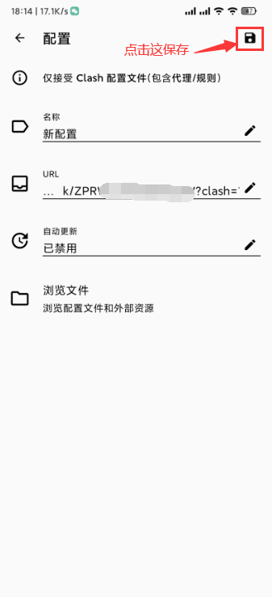
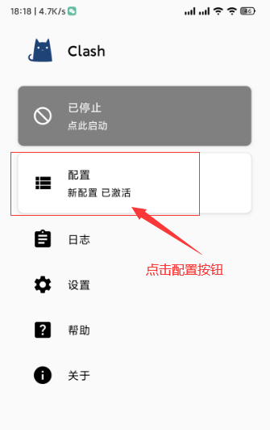
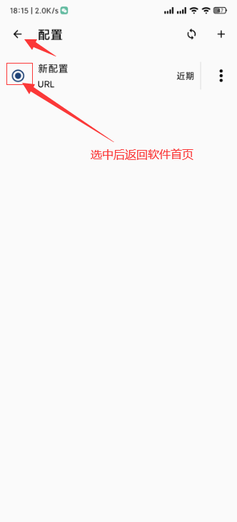
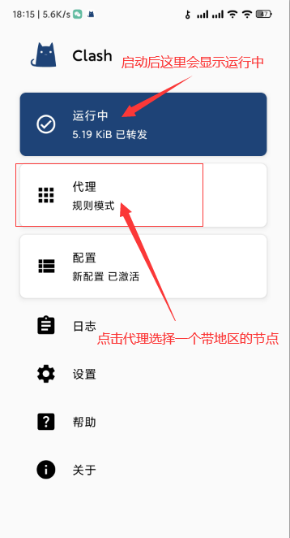
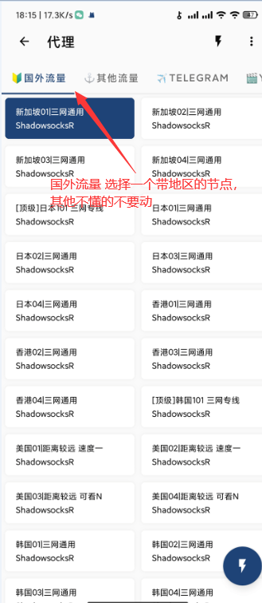

# Clash for windows

## 下载程序

网盘下载:https://wwm.lanzouw.com/ibvAZ097ypwd 密码:i5ay

## 导入节点

1.点击 一键添加 然后右上角保存；
> 如无法一键添加请多试几次或使用手机自带浏览器

[cinwell website](/sublink?type=clash ':include :type=markdown')

2.点配置-并选中后返回软件首页；

3.在软件首页按 点此启动 按钮 然后会显示运行中；

4.最后点 代理 选择一个带地区的节点。

其他不懂的配置教程又没提到的不要随意修改，除非您懂您是在做什么！