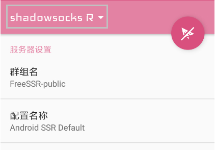
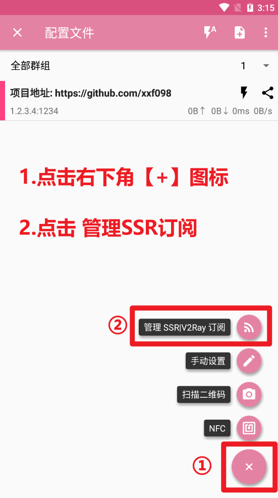
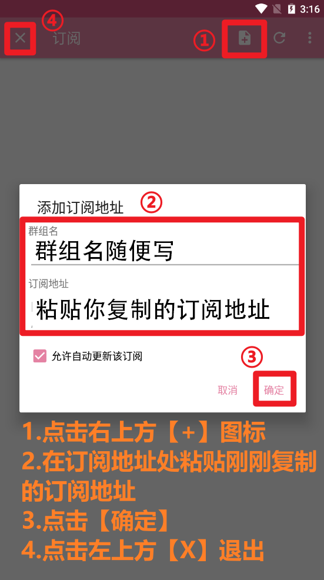
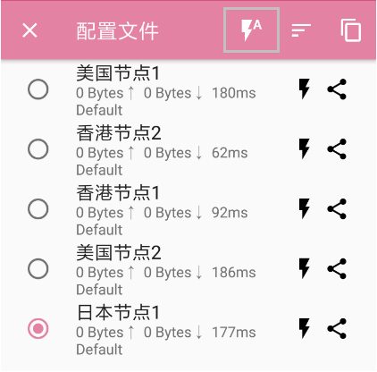
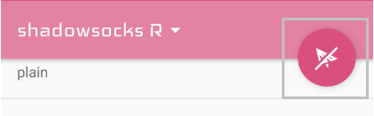
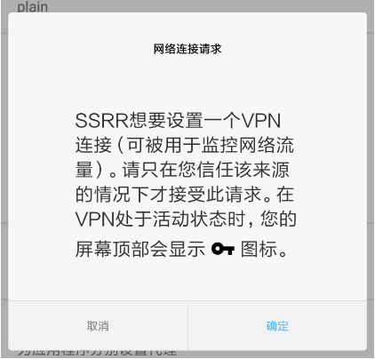

# SSRR

## 下载程序

蓝奏云盘：https://wwm.lanzouw.com/i3T9xymmn0b 密码:66jsq

[普通下载1](http://152.67.210.106/anzhuo.apk)   [普通下载2](http://193.123.235.212/anzhuo.apk)

## 导入节点

1.复制订阅链接；

[cinwell website](/sublink?type=ssr ':include :type=markdown')

2.运行 SSRR，点击左上角 “ShadowsocksR ▼”；

3.点击右下角 “+”，选择 “添加/升级 SSR 订阅”；

4.点击 “添加订阅地址”；粘贴节点订阅链接，点击 “确定”；

## 选择节点

1.在节点列表中，优先选择一个距离大陆较近的节点。

## 启动代理

1.点击右上角小飞机图标启动代理；

2.首次启动会弹出一个 “网络连接请求”，点击 “确定” 即可。

注：如果需要全网代理，下划找到 “路由”列表，切换为 “全局”。