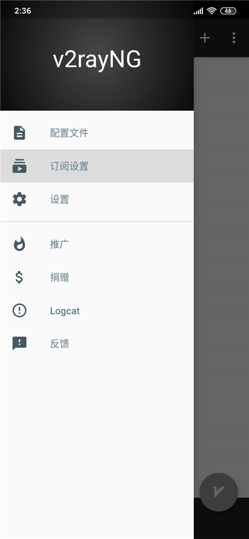
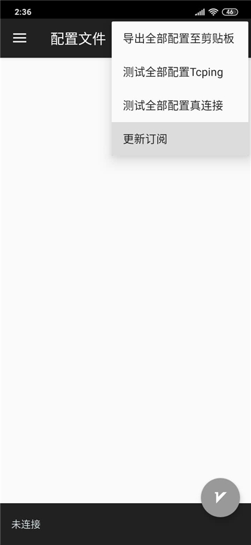
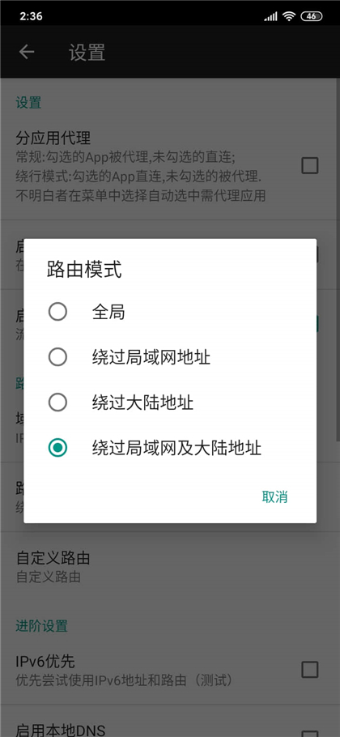
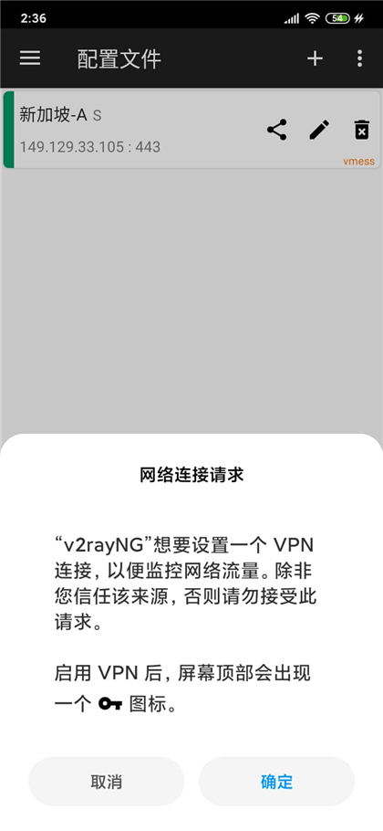
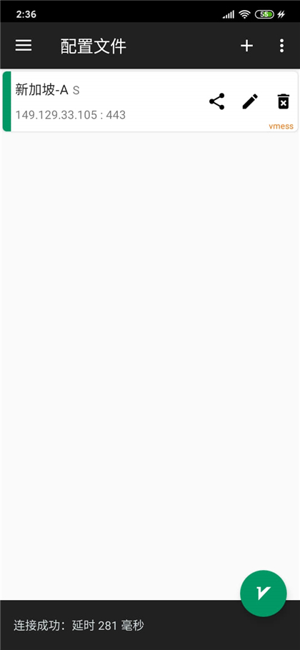

# V2rayNG

## 下载程序

Github：https://github.com/2dust/v2rayNG/releases

蓝奏网盘：https://www.lanzous.com/i92stzi 密码：8jgy

## 导入节点

1.复制订阅链接；

[cinwell website](/sublink?type=v2ray ':include :type=markdown')

2.侧栏选择 “订阅设置”；

3.右上角 “+” 号进入订阅设置页，粘贴订阅链接并填写备注，确定；

4.选择右上角 “┆”，点击 “更新订阅”；

## 修改代理模式

1.侧栏 “设置” 里，路由模式选择 “绕过局域网及大陆地址”；

## 启动代理

1.点击右下角 “V” 字图标启动，首次启动会提示一个 “网络连接请求”，选择确定即可；

2.启动成功后，点击底部黑色区域可测试节点是否可用。

