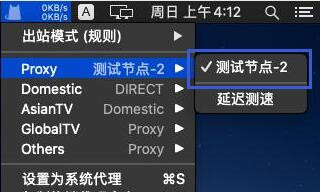
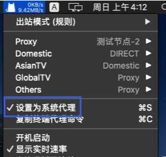

# ClashX Pro

## 下载程序

网盘下载: https://wwm.lanzouw.com/iCPNY01rq5ch 密码:66ww

备用下载: https://install.appcenter.ms/users/clashx/apps/clashx-pro/distribution_groups/public

## 导入节点

1.复制订阅链接；

[cinwell website](/sublink?type=clash ':include :type=markdown')

> 请点击上面的一键添加

1.列表中选择一个带地区的节点；

2.最后设置为系统代理，这个就是软件的开关。

其他不懂教程又没提到的配置不要随意修改！