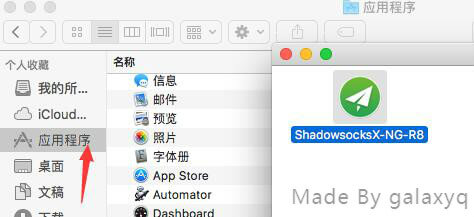
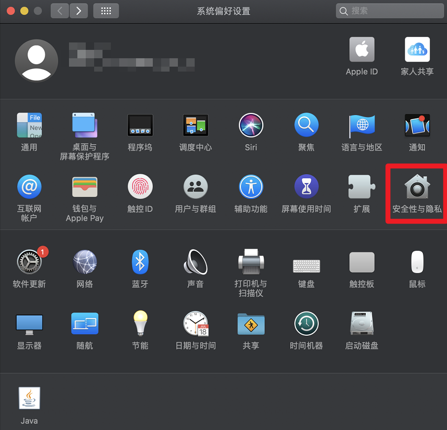
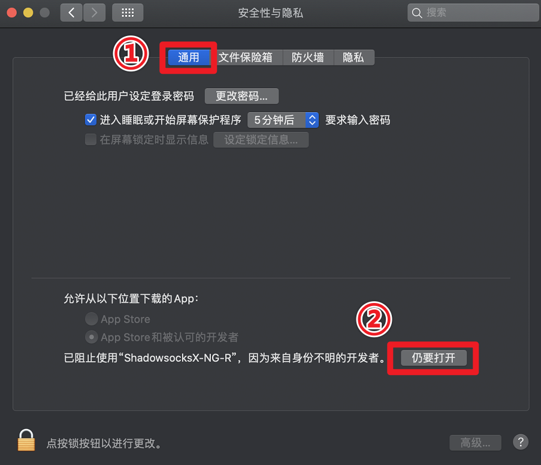
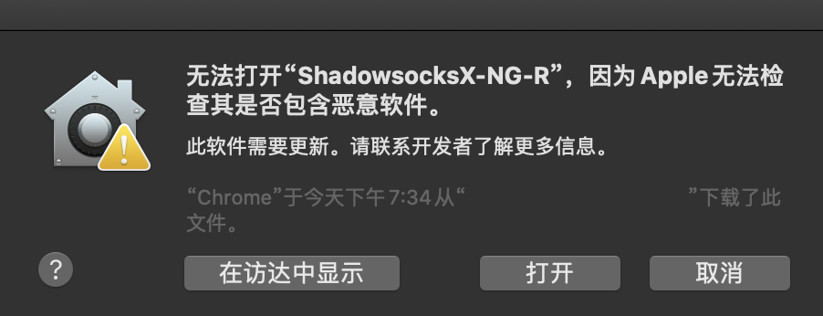
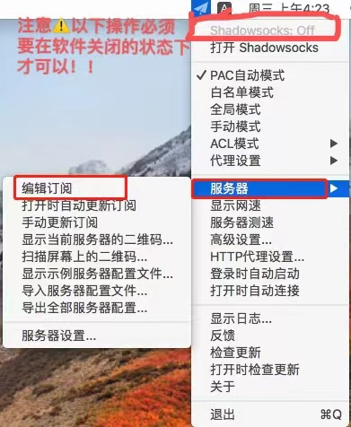
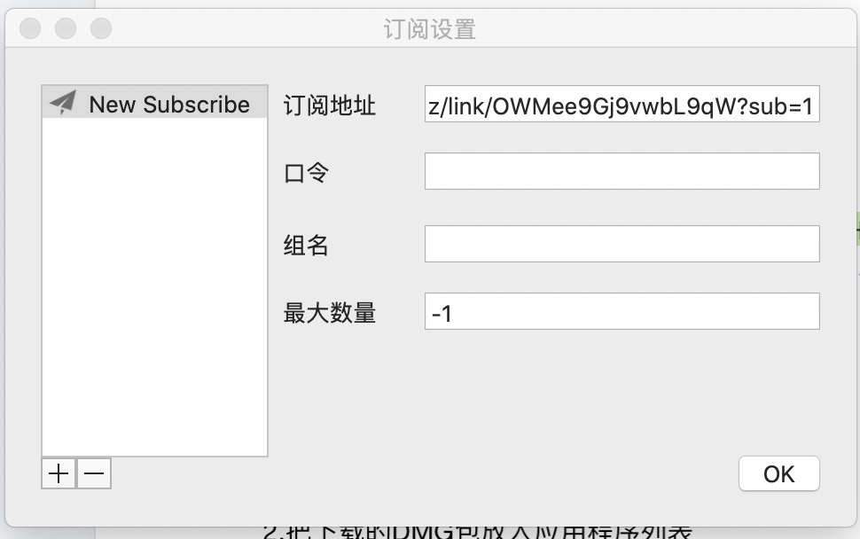
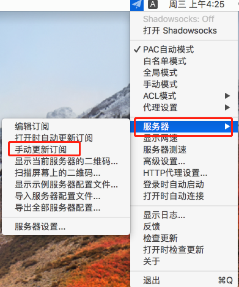
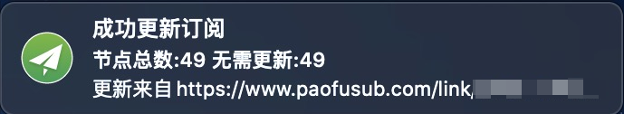
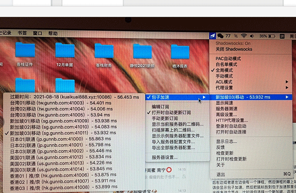

# ShadowsocksX

# 下载程序

网盘下载:https://wwr.lanzoui.com/iqHtWp3a9pc 密码:1234

# 

2.把下载的DMG包放入应用程序列表 

在 macOS 10.15 发布之后，苹果进一步提升了系统安全性，加强了软件安全性验证过程，这也导致很多用户升级之后，部分第三方软件尤其是破解版软件打不开，提示“XXX已损坏，无法打开”、“无法验证开发者”等问题。

4.打开程序 ，屏幕右上角有个小飞机。

①打开如果有提示 “因为它来自身份不明的开发者”
查看解决方法：https://jingyan.baidu.com/article/d169e1865b375f436711d844.html 复制粘贴到浏览器

②MAC 没有显示“任何来源”选项 怎么办
查看解决方法：https://jingyan.baidu.com/article/afd8f4de8e55e734e286e92a.html 复制粘贴到浏览器

如果提示 无法打开“XXX”，因为无法验证开发者，macOS无法验证此 APP 不包含恶意软件。

1.打开「系统偏好设置」2.「点击安全与隐私」

3.在「通用」选项卡中，点击「仍要打开」

4.再次打开软件，会提示 macOS 无法验证“XXX”的开发者，您确定要打开么？

5.打开软件关闭软件的状态---点击服务器----编辑订阅点进去

6.点击下面的复制SSR订阅链接

[cinwell website](/sublink?type=ssr ':include :type=markdown')

7.订阅地址框如有链接则先点击右下角   减号  先删除订阅地址，再点 加号  号复制粘贴上一步复制的ssr订阅地址，然后点击右下角 OK 

8.点击手动更新订阅

9.提示更新订阅成功，然后鼠标移到代理设置下面一行，在弹窗会看到  包子加速 ，如图任意选择前面带地名的节点然后再点最上端打开shadowsock连接即可使用

#### 注意** 一般选择pac自动模式    (PAC模式不能用就换成全局模式试试，每种模式分别用自带浏览器和谷歌浏览器测试，就可以了）

