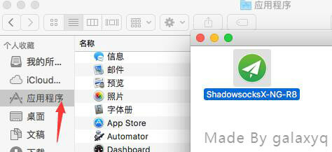
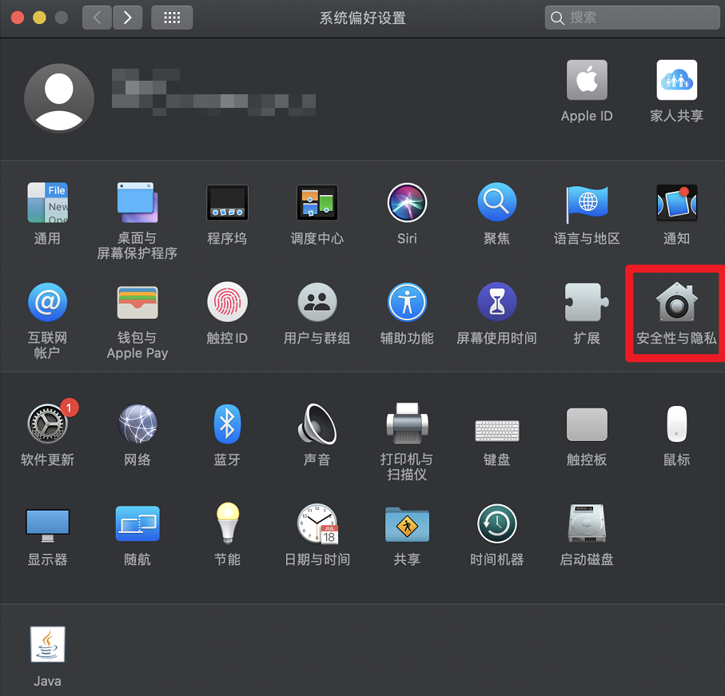
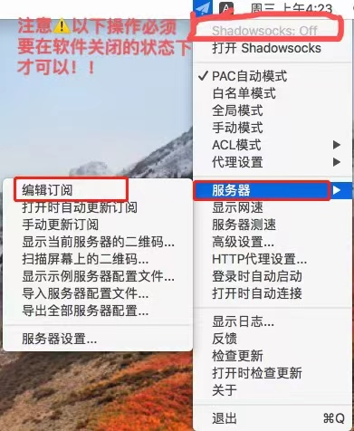

# ShadowsocksX

# 下载程序

稳定版下载:https://wwm.lanzouw.com/iBeYmymmmoj 密码:66jsq

新版(部分系统不兼容)下载:https://wwm.lanzouw.com/ixkMrymmmlg 密码:66jsq

# 

#### 1.解压下载的 ShadowsocksX-NG-R.zip 压缩包解压至桌面。； ####

> 如出现「无法打开」等报错， 请百度搜索 解决macOS软件提示损坏/无法验证开发者 等问题 。否则忽略此步骤。

#### 2.打开「系统偏好设置」，点击「安全性与隐私」； ####

1. 点击左下角的小锁图标，然后提示输入密码进行解锁
2. 授权ShadowsocksX-NG-R

#### 3.复制订阅链接； ####

[cinwell website](/sublink?type=ssr ':include :type=markdown')

#### 4.添加订阅； ####

1.在右上角找到【纸飞机】图标，点击图标打开设置菜单  
2.点击【服务器订阅】  
3.点击【订阅设置】  

4.点击左下角【+】图标添加订阅  
5.在【订阅】栏粘贴刚刚复制的订阅地址  
6.点击【更新】  

#### 5.更新订阅； ####

1.点击【服务器订阅】  
2.点击【更新订阅（不通过代理）】  
3.右上角弹出成功更新订阅  

#### 6.选择节点使用； ####

1.一般选择【PAC自动模式】  
2.点击节点列表  
3.在更新出来的分组中选择需要的节点使用  
4.点击【打开Shadowsocks】启动代理  

