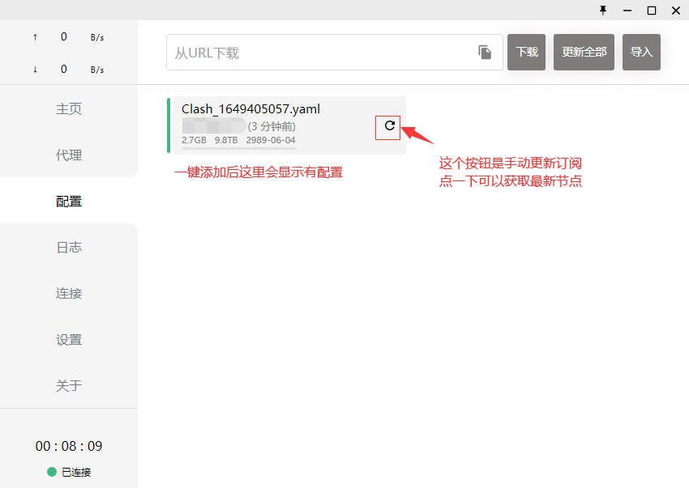
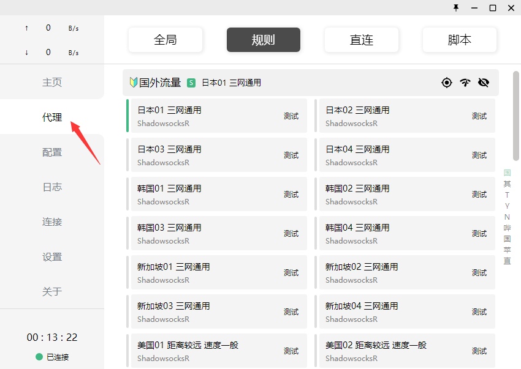
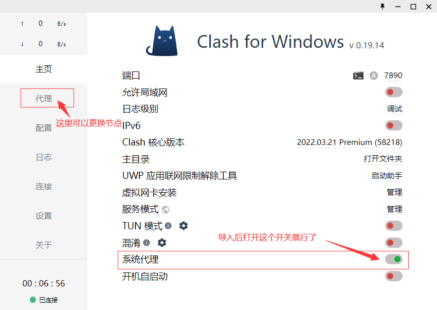

# Clash for windows

## 下载程序

网盘下载: https://wwm.lanzouw.com/iByxM06xq1sf 密码: 66js

## 导入节点

1.点击 一键添加；

[cinwell website](/sublink?type=clash ':include :type=markdown')

2.点代理-国外流量-列表中选择一个带地区的节点，比如香港01；

3.最后设置为系统代理。

### 注意：电脑关机的时候要先正常断开clash系统代理的开关(或者在电脑右下角右键退出clash)，否则下次启动电脑会导致浏览器无法正常连网！
> 如果您忘了关闭clash而直接关机，那么重新打开clash，然后打开再关闭一下系统代理开关就正常了！

其他不懂的配置教程又没提到的不要随意修改，除非您清楚您是在做什么！