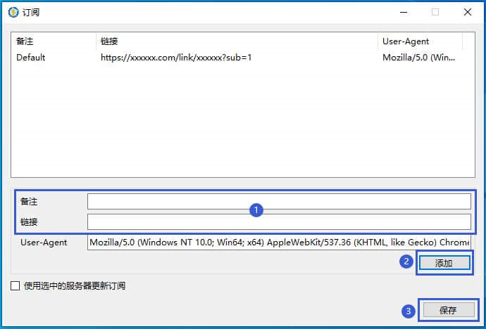
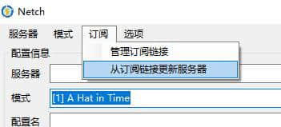
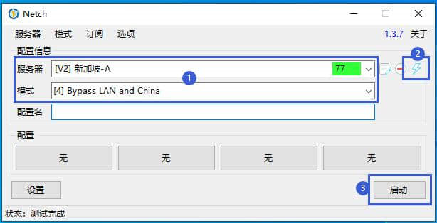

# Netch

## 下载程序

蓝奏云盘：https://www.lanzoui.com/i92jzsd 密码：3v4c

## 导入节点

1.安装完成后，运行 Netch，点击 「订阅》管理订阅链接」；

2.复制订阅链接；

[cinwell website](/sublink?type=ssr ':include :type=markdown')

3.粘贴订阅链接至 “链接” 里，并填写 “备注”，然后点击 “添加”，保存；

4.点击 「订阅》从订阅链接更新服务器」更新节点；

5.“服务器” 列表选择一个节点，模式选择 “[4] Bypass LAN and China” 可绕过中国站点，点击闪电图标检测连接状态和延迟，最后就可以启动了。

