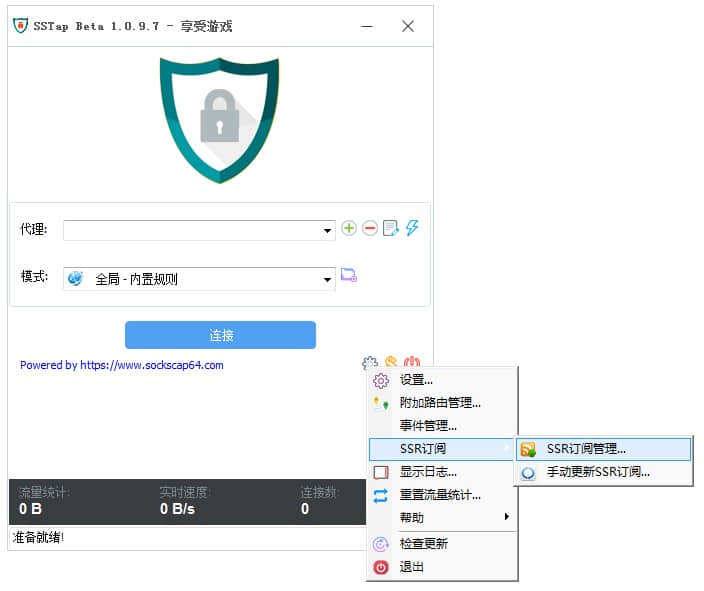
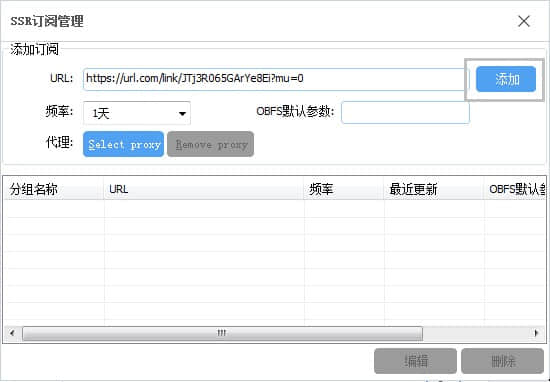
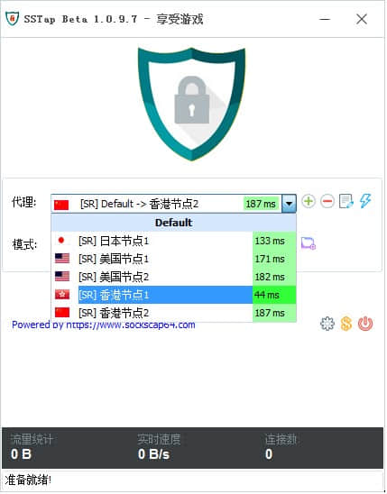
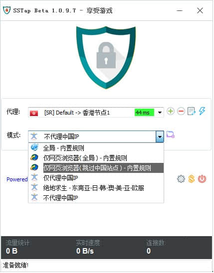
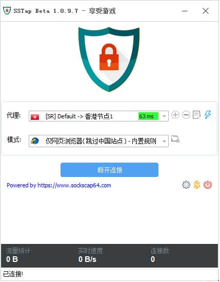

# SStap

## 下载程序

蓝奏云盘：https://wwm.lanzouw.com/iv8rQymmmje 密码:66jsq

[普通下载1](http://152.67.210.106/diannao.zip)   [普通下载2](http://193.123.235.212/diannao.zip)

## 导入节点

1.安装完成后，运行 SSTap，点击 「设置》SSR订阅》SSR订阅管理...」；

2.复制订阅链接；

[cinwell website](/sublink?type=ssr ':include :type=markdown')

3.粘贴订阅链接至 “URL” 里，然后点击 “添加”，关闭界面；

## 选择节点

1.在 “代理” 列表中选择节点；
> 请优先选择离大陆近的节点，如果您是移动、长城宽带等比较差的网请优先选择带 国际优化的节点。

## 启动代理

1.“模式” 列表中一般选择 “仅网页浏览器（跳过中国站点）” ，适合日常上网。
> 显示0ms不代表不能用，只是没自动检测，请点闪电测试，TCP通过即可，UDP不用管！UDP没有用！

2.点击 “连接” 即可上网。

