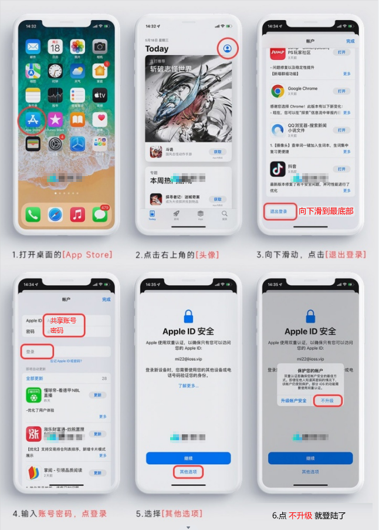
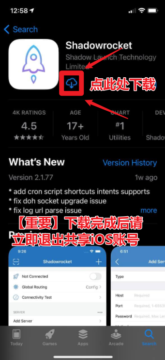
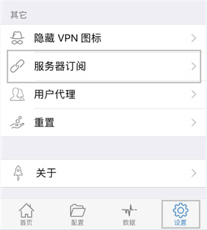
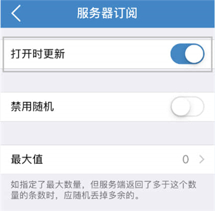
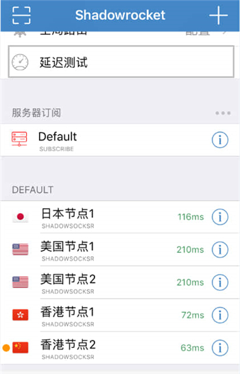
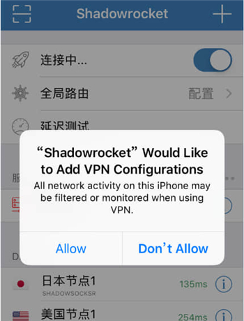

# Shadowrocket
> 俗称：小火箭

## 下载程序

### 购买套餐后在右上角 用户中心-共享账号 里找到我们提供的外国AppleID
> 请不要在设置里登录，只需在 AppStore 里登录，下载完请退出ID！

> 搜索 Shadowrocket 下载，一模一样的图标才是真小火箭！

## 导入节点

1.点击下面一键添加；

[cinwell website](/sublink?type=shadowrocket ':include :type=markdown')

## 开启自动更新订阅

1.点击右下角 “设置”，找到并点击 “服务器订阅”；

2.开启 “打开时更新“ 选项。

## 选择节点

1.返回到首页，点击 “延迟测试”或“连通性测试”，然后选择一个可用节点。

## 启动代理

1.首次启动会提示 “Shadowrocket 想要添加 VPN 配置”，点击“Allow”或“确定”输入解锁密码即可。

### 教程里没写又不懂的设置请不要随意更改，除非您懂您是在做什么！
